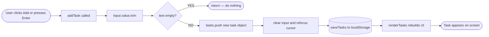
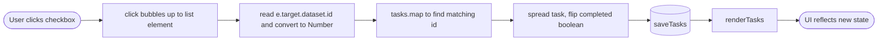
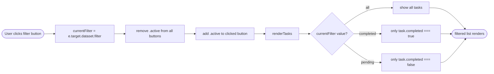
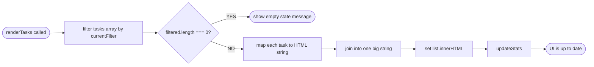

# 📋 To-Do List App

> A clean, lightweight task manager built with **vanilla HTML, CSS, and JavaScript**. No frameworks, no dependencies — just the fundamentals done well.


---

## Table of Contents

- [Features](#features)
- [File Structure](#file-structure)
- [How to Run](#how-to-run)
- [Data Model](#data-model)
- [Core Functions](#core-functions)
- [Flowcharts](#flowcharts)
- [Event Listeners](#event-listeners)
- [Event Delegation](#event-delegation)
- [localStorage](#localstorage)
- [The Bug and The Fix](#the-bug-and-the-fix)
- [JS Concepts Used](#js-concepts-used)
- [Roadmap](#roadmap)

---

## Features

| Feature | Description |
|---|---|
| ✅ Add tasks | Click button or press `Enter`. Empty inputs are blocked. |
| ☑️ Complete tasks | Checkbox toggles done state with strikethrough styling. |
| 🗑️ Delete tasks | Remove individual tasks instantly. |
| 🔍 Filter tasks | View All, Completed, or Pending separately. |
| 📊 Live stats | Tasks left and completed count update in real time. |
| 💾 Persistence | Tasks survive page refresh via `localStorage`. |
| 🌙 Dark mode | Toggle saved to `localStorage`. |
| 📭 Empty state | Friendly message when no tasks match the current filter. |

---

## File Structure

```
todo/
├── index.html     ← structure and skeleton
├── style.css      ← all visual styling
└── script.js      ← all logic and behaviour
```

No build step. No `node_modules`. Open and it works.

---

## How to Run

**Option 1 — Just open the file:**
```
double-click index.html
```

**Option 2 — VS Code Live Server:**
```
Right-click index.html → Open with Live Server
```

**Option 3 — Node static server:**
```bash
npx serve .
```

---

## Data Model

The entire app lives in one array called `tasks`. Every task is an object with exactly three properties:

```javascript
{
  id: 1712580293847,   // unique number from Date.now()
  text: "Buy milk",    // what the user typed
  completed: false     // has it been checked off?
}
```

The full state is just an array of these objects:

```javascript
let tasks = [
  { id: 1712580000001, text: "Buy milk",     completed: true  },
  { id: 1712580000002, text: "Walk the dog", completed: false },
  { id: 1712580000003, text: "Read a book",  completed: false },
];
```

| Property | Type | Purpose |
|---|---|---|
| `id` | Number | Unique identifier. Used to find and modify specific tasks without relying on array index. |
| `text` | String | The task description entered by the user. |
| `completed` | Boolean | Whether the task is done. Toggled by the checkbox. `!task.completed` flips it. |

> **Why `Date.now()` for IDs?** It returns the current timestamp in milliseconds — a number that changes every millisecond, so every task gets a unique one. It's a quick trick that works fine for small apps.

---

## Core Functions

Every piece of behaviour lives in one of these four functions. They call each other in a predictable chain.

| Function | Does what | Calls |
|---|---|---|
| `addTask()` | Reads input, validates, pushes to array, clears input, refocuses cursor | `saveTasks()`, `renderTasks()` |
| `renderTasks()` | Filters array, rebuilds entire list HTML, handles empty state | `updateStats()` |
| `updateStats()` | Counts tasks and completed items, updates the DOM spans | — |
| `saveTasks()` | Serialises the array and writes it to localStorage | — |

**The call chain — every user action eventually triggers this:**

```
User Action
  → modify tasks array
    → saveTasks()       // persist to localStorage
      → renderTasks()   // rebuild the UI
        → updateStats() // update the counters
```

---

## Flowcharts

### Add Task Flow



### Toggle Complete Flow



### Filter Tasks Flow



> **Key insight:** The original `tasks` array is never modified during filtering. It only affects what gets *displayed*. The data always stays intact.

### renderTasks() Flow



---

## Event Listeners

There are exactly five event listeners in the whole app. Each one has a single focused job.

| Attached to | Event | What it does |
|---|---|---|
| `addBtn` | `click` | Calls `addTask()` |
| `input` | `keydown` | Checks if key was `Enter`, then calls `addTask()` |
| `list` (the `<ul>`) | `click` | Handles both delete and checkbox toggle via event delegation |
| `.filters` (div) | `click` | Updates `currentFilter`, swaps `.active` class, re-renders |
| `#dark-toggle` | `click` | Flips dark mode boolean, saves to localStorage |

---

## Event Delegation

Instead of attaching a listener to every task's button and checkbox individually — which would break every time `renderTasks()` wipes and rebuilds the HTML — **one listener sits on the parent `<ul>`**.

When you click anything inside the list, the event *bubbles up* through the DOM until it reaches the `<ul>`, where the listener catches it. We then inspect `e.target` to figure out exactly what was clicked.

```
<ul id="task-list">         ← listener lives here
  <li class="task">
    <input type="checkbox"> ← click bubbles UP
    <span>Buy milk</span>
    <button>Delete</button> ← click bubbles UP
  </li>
</ul>
```

```javascript
// ONE listener handles ALL tasks — past, present, and future
list.addEventListener("click", (e) => {
  const id = Number(e.target.dataset.id);

  if (e.target.tagName === "BUTTON") {
    // delete this task
  }

  if (e.target.type === "checkbox") {
    // toggle this task
  }
});
```

Without delegation, you'd need to re-attach listeners every single time `renderTasks()` rebuilds the HTML. Delegation sidesteps this entirely.

---

## localStorage

`localStorage` is the browser's built-in key-value store. Data survives page refreshes but is cleared when the user clears browser data. The app uses two keys:

| Key | Value | When saved |
|---|---|---|
| `tasks` | JSON string of the full tasks array | Every add, delete, or toggle |
| `darkMode` | `"true"` or `"false"` | Every dark mode toggle |

```javascript
// Saving — array must be converted to a string first
localStorage.setItem("tasks", JSON.stringify(tasks));

// Loading — string must be converted back to an array
// || [] means "if nothing saved yet, start with empty array"
let tasks = JSON.parse(localStorage.getItem("tasks")) || [];
```

`localStorage` can only store strings. `JSON.stringify` converts the array to a string for saving. `JSON.parse` converts it back to a real array when loading.

---

## The Bug and The Fix

The original code had a subtle but critical bug: **checkboxes appeared to do nothing when clicked.**

### Root Cause

There were **two separate click listeners on the same `list` element** — one from an earlier draft of the code, one from the refactored version. When a checkbox was clicked:

1. First listener fired → toggled `completed` to `true`
2. Second listener fired immediately after → toggled `completed` back to `false`
3. Net result: state returned to exactly where it started, UI didn't change

```javascript
// WRONG — two listeners on the same element
list.addEventListener("click", (e) => {
  // old version — no localStorage calls
  if(e.target.type === "checkbox"){ ... }
});

list.addEventListener("click", (e) => {
  // new version — with localStorage
  if (e.target.matches("input[type='checkbox']")){ ... }
});
```

### The Fix

Delete the first listener entirely. Keep only the second. **One listener per element per event.**

```javascript
// CORRECT — single listener, handles everything
list.addEventListener("click", (e) => {
  const id = Number(e.target.dataset.id);

  if (e.target.tagName === "BUTTON") {
    tasks = tasks.filter(task => task.id !== id);
  }

  if (e.target.type === "checkbox") {
    tasks = tasks.map(task =>
      task.id === id ? { ...task, completed: !task.completed } : task
    );
  }

  saveTasks();
  renderTasks();
});
```

> **Lesson:** When refactoring, always delete the old code. Duplicate listeners cause the state to change twice and cancel itself out — one of the sneakiest bugs in JS.

---

## JS Concepts Used

### Spread operator — immutable update

```javascript
// Mutates the original object directly — avoid this
task.completed = true;

// Creates a new object with the change applied — do this instead
{ ...task, completed: true }

// ...task copies all existing properties, then we override just one
```

### Guard clause — early return

```javascript
// Without guard — real work is nested
function addTask() {
  if (text) {
    // everything lives inside here
  }
}

// With guard — flat and readable, bails early on bad input
function addTask() {
  if (!text) return;  // stop here if empty
  // everything at the top level
}
```

### join("") — building HTML from an array

```javascript
// .map() returns an ARRAY of strings:
["<li>Task 1</li>", "<li>Task 2</li>"]

// .join("") stitches into ONE string:
"<li>Task 1</li><li>Task 2</li>"

// innerHTML expects a single string, not an array
list.innerHTML = filtered.map(task => `<li>...</li>`).join("");
```

### Ternary operator

```javascript
// One-line if/else:   condition ? "if true" : "if false"

// Example — singular vs plural:
`${pending} task${pending !== 1 ? "s" : ""} left`
// pending = 1 → "1 task left"
// pending = 3 → "3 tasks left"
```

### Boolean toggle

```javascript
task.completed = !task.completed
// true  → false
// false → true
```

### Scope — why variables live where they do

```javascript
function renderTasks() {
  const filtered = tasks.filter(...); // only exists INSIDE this function

  if (filtered.length === 0) { ... }  // works — same scope
}

if (filtered.length === 0) { ... }    // ReferenceError — filtered doesn't exist out here
```

---

## Roadmap

### Done ✅
- [x] Add / Delete / Toggle tasks
- [x] Filter — All / Completed / Pending
- [x] Empty state message
- [x] Live stats — tasks left + completed count
- [x] Enter key support + auto-focus after adding
- [x] Prevent empty input
- [x] Dark mode with localStorage persistence

### Next 🔵
- [ ] Edit task on double-click — inline editing, swap span for input
- [ ] Confirm before delete — `confirm()` dialog
- [ ] Clear all completed — one-click button
- [ ] Fade-in animations — CSS `@keyframes` on new tasks
- [ ] Unique ID improvement — timestamp + random string

### Future 🟡
- [ ] Drag to reorder — HTML5 drag-and-drop API
- [ ] Due dates — date property per task, highlight overdue
- [ ] Categories / tags — group tasks with colour-coded labels
- [ ] Export to JSON — download your tasks as a file

---

*Built as a learning project — working through vanilla JS fundamentals one feature at a time.*